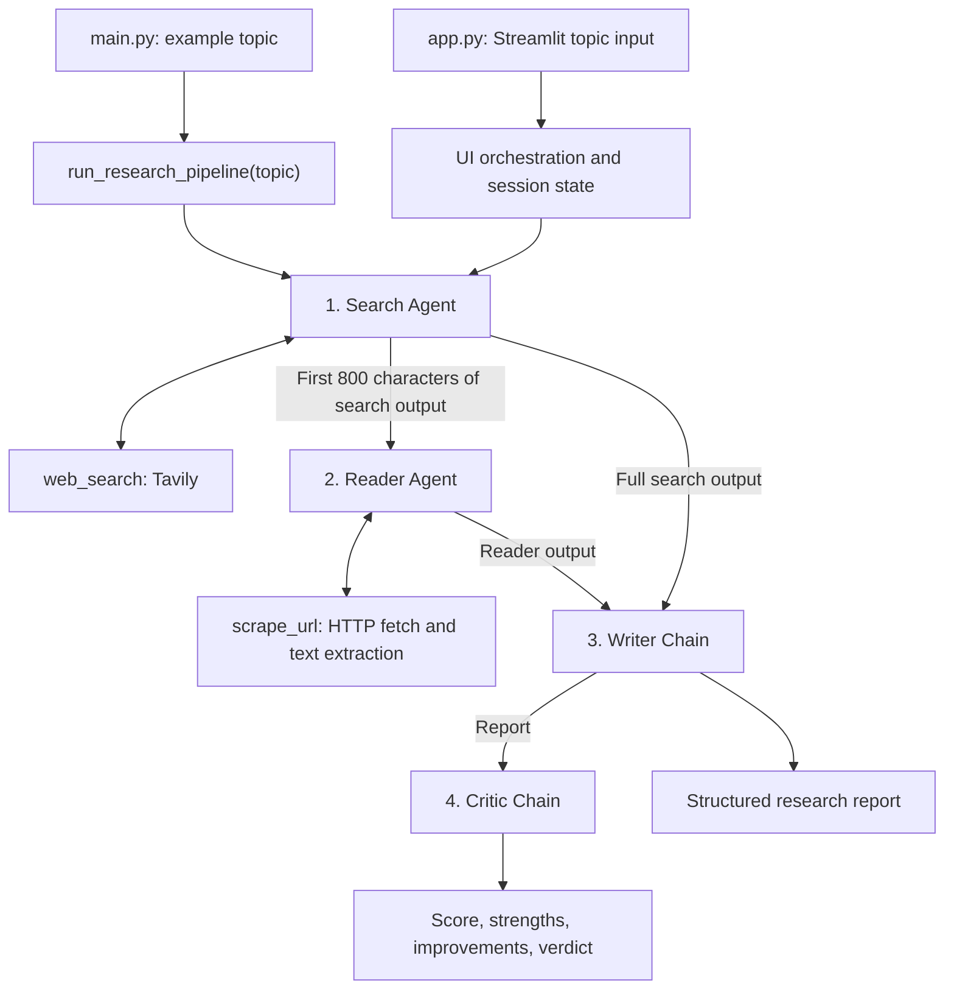

# LangChain Multi-Agent Research System

A Python research assistant that searches the web, reads a relevant source, drafts a structured report, and critiques the result. Built with LangChain, Google Gemini, Tavily, and Streamlit, it supports an interactive interface with Markdown downloads and a reusable Python pipeline.

## Architecture

The system runs four stages sequentially: **Search Agent → Reader Agent → Writer Chain → Critic Chain**. Search and Reader are tool-using agents created with `create_agent`; Writer and Critic use `ChatPromptTemplate | llm | StrOutputParser()`.



All stages share the `ChatGoogleGenerativeAI` instance in [src/agents/agents.py](src/agents/agents.py), currently configured with `model="gemini-3.6-flash"` and `temperature=0`. This is the identifier in the source; execution depends on its availability to your Google API account.

### Components

| Component | Responsibility |
| --- | --- |
| [app.py](app.py) | Streamlit interface, topic validation, stage spinners, session results, report display, and Markdown download. Implements its own sequential orchestration. |
| [main.py](main.py) | Runs the Python pipeline with the example topic `Artificial Intelligence in Healthcare`. |
| [src/pipelines/pipeline.py](src/pipelines/pipeline.py) | Exposes `run_research_pipeline(topic)`, invokes the four stages, prints outputs, and returns a result dictionary. |
| [src/agents/agents.py](src/agents/agents.py) | Shared Gemini model, Search and Reader agent builders, Writer and Critic prompts and chains. |
| [src/tools/tools.py](src/tools/tools.py) | LangChain tools for Tavily search and webpage extraction. |

The Streamlit app imports the agents and chains directly; it does not call `run_research_pipeline()`. Changes to orchestration must therefore be reflected in both `app.py` and `src/pipelines/pipeline.py`.

### Data flow

1. **Search:** The Search Agent receives the topic and can call `web_search`. Each tool call requests up to five Tavily results, formatted as titles, URLs, and snippets truncated to 300 characters each. The agent's final message becomes the search output.
2. **Read:** The Reader Agent receives the topic and the first 800 characters of the search output. It is prompted to select the most relevant URL and call `scrape_url`. Its final message becomes the reader output.
3. **Write:** The Writer Chain receives the topic, full search output, and reader output. Its prompt requests an introduction, at least three explained key findings, a conclusion, and source URLs.
4. **Critique:** The Critic Chain receives the report and is prompted to return a score out of 10, strengths, areas to improve, and a one-line verdict. Feedback is returned separately and does not trigger a revision.

### Webpage extraction

`scrape_url` fetches a page with `requests.get` and a 15-second timeout, then tries these strategies in order:

1. **Trafilatura:** Extract article text without comments or tables; accept it if it exceeds 200 characters.
2. **Readability + BeautifulSoup:** Extract main content and remove common non-content elements; accept it if it exceeds 200 characters.
3. **BeautifulSoup fallback:** Extract full-page text after removing common non-content elements.

Successful output is whitespace-normalized and limited to 5,000 characters. Timeouts, HTTP errors, and other extraction failures are returned as text messages to the agent.

## Project structure

```text
LangChain-MultiAgent-Research-System-/
├── app.py                     # Streamlit interface and orchestration
├── main.py                    # Command-line example
├── requirements.txt           # Python dependencies
├── README.md
├── LICENSE
└── src/
    ├── __init__.py
    ├── agents/
    │   ├── __init__.py
    │   └── agents.py          # Shared model, agent builders, and chains
    ├── pipelines/
    │   ├── __init__.py
    │   └── pipeline.py        # Reusable research function
    └── tools/
        ├── __init__.py
        └── tools.py           # Search and scraping tools
```

## Setup

Run these commands from the repository root. The Conda environment below uses Python 3.11.

```bash
conda create -n langagent python=3.11 -y
conda activate langagent
python -m pip install -r requirements.txt
```

Create or update a local `.env` file in the repository root:

```dotenv
GOOGLE_API_KEY=your_google_api_key
TAVILY_API_KEY=your_tavily_api_key
```

The project loads settings with `python-dotenv`. Configure credentials before starting either entry point, because the Gemini model and Tavily client are initialized during import. Keep real keys out of version control.

Dependencies are listed in [requirements.txt](requirements.txt). Installed versions must provide the APIs used in the source, including `langchain.agents.create_agent` and Streamlit's `st.rerun`. The broad dependency lower bounds are not a verified compatibility matrix; the repository has no dependency lockfile.

## Usage

### Streamlit interface

```bash
python -m streamlit run app.py
```

Open the local URL printed by Streamlit, enter a topic, and select **Run Research Pipeline**. The interface displays stage spinners, expandable search and reader outputs, the final report, and critic feedback. **Download Report (.md)** saves the report only.

Results are stored in Streamlit session state. There is no database or persistent research history.

### Command-line example

```bash
python main.py
```

This runs the topic defined in `main.py` and prints each stage's output. Edit its `topic` variable to change the subject; the script does not accept command-line arguments.

### Python integration

```python
from src.pipelines.pipeline import run_research_pipeline

result = run_research_pipeline("Applications of AI in renewable energy")
print(result["report"])
print(result["feedback"])
```

The function returns all stage outputs. The UI stores equivalent outputs under different keys:

| Python pipeline key | Streamlit results key | Content |
| --- | --- | --- |
| `search_results` | `search` | Search Agent's final message |
| `scraped_content` | `reader` | Reader Agent's final message |
| `report` | `writer` | Generated research report |
| `feedback` | `critic` | Critic evaluation |

Search and reader outputs are agent responses and may summarize tool results; they are not guaranteed to contain the complete raw tool output. The Python pipeline does not automatically save files.

## Current limitations

- Orchestration is synchronous and sequential, without parallel research branches or an automatic critique-and-rewrite loop.
- Reader context is truncated to 800 characters, which can omit URLs or useful details. The reader is prompted to select one relevant source.
- Scraping uses HTTP requests without browser rendering, so JavaScript-dependent or restricted pages may not yield useful content.
- Scraping errors are returned as text and can reach the writer as research input. Search and model failures have no application-level retry or recovery handling.
- Report sections, source listings, and critic scores are prompt instructions rather than validated schemas. There is no independent citation or factual verification step.
- The pipeline assumes agent message content can be used as text. Responses containing structured content blocks may require normalization.
- The repository has no automated tests. A complete run requires network access and valid service credentials.

## Customization

| Change | Location |
| --- | --- |
| Model, temperature, writer structure, or critic criteria | `src/agents/agents.py` |
| Search result count, snippet length, scrape timeout, or extraction limits | `src/tools/tools.py` |
| Stage order, data passed between stages, or reader context length | Both `src/pipelines/pipeline.py` and `app.py` |
| Default command-line topic | `main.py` |
| Interface styling, example topics, or download behavior | `app.py` |

## License

Licensed under the Apache License 2.0. See [LICENSE](LICENSE).
